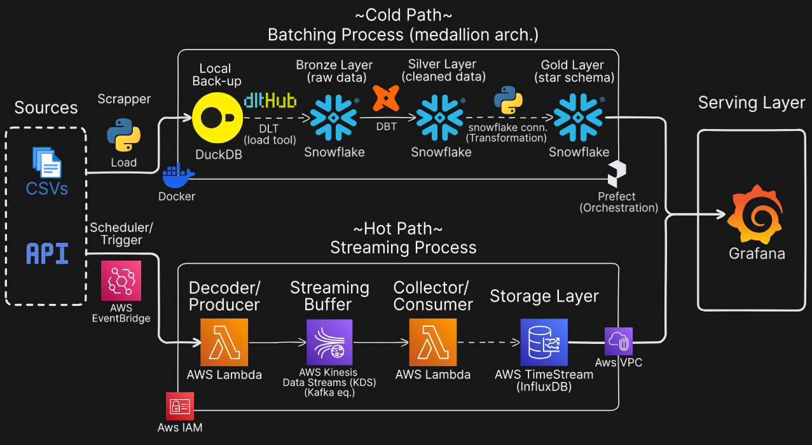
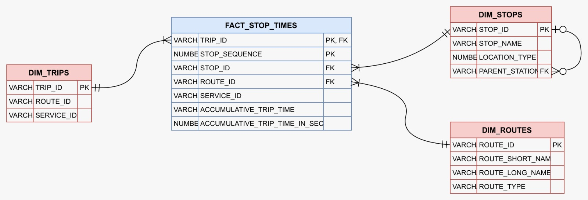

# 🚇 Real-Time NYC Transit Monitoring & Analytics Platform

> An End-to-End Data Pipeline using MTA Public API & Data

A fully automated data engineering platform that seamlessly ingests, processes, and analyzes both static and real-time MTA transit data to provide operational insights and performance analytics for NYC's transportation network.

## 📊 Project Overview

This project demonstrates a complete real-time data pipeline that solves a critical challenge: **unifying MTA's disconnected data sources** into a single, low-latency analytical system.

### Key Questions Answered

**Static Analysis:**
- What is the total network coverage (routes, stops, trips)?
- Which routes handle the highest volume?
- What are the longest routes by duration?
- Which stations serve the most trips?

**Real-Time Monitoring:**
- What is the current service health (active data points, delays)?
- Which routes are experiencing the most delays?
- Where are the delay hotspots in the network?
- How many active alerts are affecting operations?

### Target Audience

- **Transit Operations Staff** — Real-time service health data for proactive decision-making
- **Performance Analytics Teams** — Retrospective analysis to identify bottlenecks and inform long-term planning
- **NYC Mayor's Office** — Strategic oversight of transit system performance

## 🗃️ The Challenge

### Problem Statement

MTA data exists in two fundamentally disconnected formats:

- **Static schedules**: Text files requiring batch processing
- **Real-time updates**: GTFS-Realtime Protocol Buffers (streaming data)

### Impact

❌ Cannot efficiently correlate 'planned' vs 'actual' service  
❌ Protocol Buffer encoding is not human-readable  
❌ Limited operational visibility  

### Our Solution

✅ Unified data pipeline capable of seamlessly ingesting, decoding, and joining both data sources  
✅ Low-latency processing for real-time insights  
✅ Historical storage for operational analytics  

## 🏗️ Architecture

The pipeline follows a Lambda architecture combining batch and streaming processing:

### Tech Stack

| Component | Technology | Purpose |
|-----------|------------|---------|
| **Batch Processing** | Python, DBT | Ingest and transform static GTFS data (9 CSV files) |
| **Stream Processing** | Apache Kafka | Real-time ingestion of GTFS-Realtime Protobuf data |
| **Transformation** | DBT (Silver), Python (Gold) | Data standardization, quality tests, star schema design |
| **Storage** | PostgreSQL/Data Warehouse | Staging and production schemas |
| **Orchestration** | Apache Airflow, Docker | Workflow scheduling and containerization |
| **Monitoring** | Grafana | Real-time dashboards and analytics |
| **Project Management** | Jira (Kanban) | Agile task tracking |

## 📊 Data Sources

### Batch Data (Static Schedules)
- **Format**: 9 flat text files (CSV format)
- **Focused Entities**: Routes, Trips, Stops, Stop Times
- **Coverage**: Subways, Railroads, Buses

### Real-Time Data (Live Updates)
- **Format**: RESTful API (Protobuf encoded)
- **Metrics**: Delays, Active Alerts, Service Status
- **Update Frequency**: Continuous streaming

## 🔄 Workflow

### 1. Data Ingestion
- **Batch Pipeline**: Ingest 9 CSV files containing static GTFS data
- **Streaming Pipeline**: Consume real-time Protobuf-encoded API data via Kafka

### 2. Silver Layer (DBT Transformations)
- Standardize table names to `snake_case`
- Set correct data types (e.g., `bigint` → `timestamp`)
- Add calculated columns (e.g., `stop_duration`)
- Implement integrity tests on primary keys
- Validate referential integrity with framework tests
- Output: New `staging` schema

### 3. Gold Layer (Python Transformations)
- Remove unnecessary tables
- Design and implement **star schema**
- Add calculated column: `trip_duration`
- Output: New `NYC_transit` production schema

### 4. Star Schema Design

### 5. Containerization & Orchestration
- **Docker**: Containerized services for portability
- **Prefect**: Scheduled DAGs for automated pipeline execution

### 6. Monitoring & Visualization
- **Grafana**: Live dashboards with real-time and historical metrics

### Quality Assurance
- **Primary Key Tests**: Ensure uniqueness across all dimension tables
- **Referential Integrity**: Validate foreign key relationships
- **Composite Keys**: Handle multi-column primary keys in fact tables

## 📈 Key Insights

### Batch Analysis
📊 **Network Scale**:
- 29 routes covering 1,488 stops
- 84,384 weekly trips (high utilization)

🚇 **Route Performance**:
- Route L handles 6,000+ trips (highest volume)
- Routes F, D, Z have longest durations (100+ minutes)

🏢 **Major Hubs**:
- Canal St, 125 St, Times Sq-42 St serve 140,000+ trips each

### Real-Time Monitoring
⚡ **System Health**:
- Average delay: **0.139 seconds** (excellent performance)
- 322 active alerts (high alert volume)

🔴 **Problem Areas**:
- Route L: 11,164 seconds total delay (needs attention)
- Delay hotspots: L29S, L28S, L03N stations

## 💡 Recommendations

### For Transit Operations
🎯 **Immediate Actions**:
- Focus resources on Route L (highest delays & trip volume)
- Investigate infrastructure issues at L29S, L28S, L03N stations
- Implement alert prioritization system (322 alerts may cause operator fatigue)
- Monitor routes with 80+ stops for schedule optimization opportunities

### For Performance Analytics
📊 **Long-Term Studies**:
- Correlate long trip durations (Routes F, D, Z) with delay patterns
- Analyze peak hour patterns at top-volume stations
- Study relationship between trip volume and delay frequency
- Identify seasonal trends in service disruptions

## 📊 Dashboards

- **Static Metrics**: Total routes, stops, trips per route, longest routes
- **Real-Time Metrics**: Active data points, average delay, alert count
- **Time-Series Analysis**: Delays over time by route
- **Comparative Analysis**: Planned vs actual service delivery

## 👥 Team

* **AbdAelrahman Mostafa** 
* **Hussein Mohamed** 
* **Yousef Mahmoud** 
* **Moaaz Omar Abdefattah** 
* **Maher Mahmoud**

---

**Presentation Date**: December 18, 2025

---

*Built with ❤️ for better NYC transit operations*